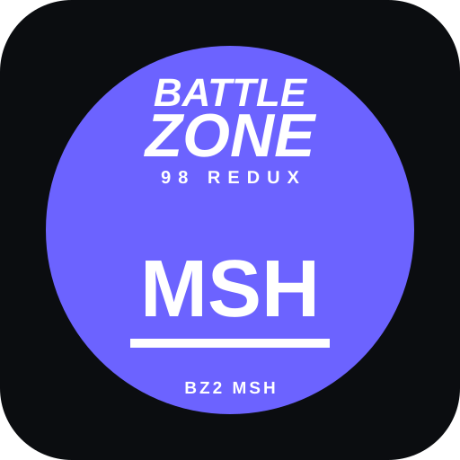

<p align="center">
  
</p>

# Battlezone II / Combat Commander MSH Importer for Blender 4.5+

A modern Blender Extension for importing Battlezone II and Battlezone Combat Commander `.msh` assets, including rigid hierarchies, skinned models, animations, materials, textures, and assets stored inside `.pak` archives.

Forked from the original [frute94/io_scene_bz2msh](https://github.com/frute94/io_scene_bz2msh).

> **Release status:** the latest tagged release is **v1.2.0**. The current `main` branch includes additional post-release fixes for skinned imports, hierarchy parsing, BZ2R/BZCC `.material` files, BC4/BC5 textures, and animation isolation. This README documents the current `main` behavior.

## Features

### Meshes and Hierarchies

- **Global and local import modes** for static review or full object hierarchies.
- Correct handling of BZ2's **left-handed coordinate system**, including mesh positions, normals, transforms, and face winding.
- Correct bracketed node-tree parsing: each node closes with its own `END`, and `SIBLING` follows the previous sibling's `END`.
- Support for alternate and skinned MSH layouts found in Battlezone II / BZCC content.
- **Multi-file import** from Blender's file browser; multiple selected MSH files are imported as separate collections.
- Degenerate triangles are dropped before custom-normal creation to avoid Blender crashes on malformed or edge-case source geometry.

### Skinned Models

- **Skinned as Armature** imports pilots, creatures, walkers, and other skinned blocks as:
  - a Blender Armature,
  - one weighted mesh,
  - vertex groups derived from `vert_to_state`,
  - rest transforms derived from per-node `state_matrices`.
- GLOBAL mode also supports skinned blocks by rebuilding faces from the per-corner records when the block index list is empty.
- Each animation clip becomes a bone Action for skinned imports.

### Animation

- Imports block-level animations into Blender 4.5 **Action Slots**.
- Animation targets are resolved by MSH `state_index`, which is required for multi-part vehicles, deployables, and characters.
- Key types are respected:
  - `1` = position,
  - `2` = rotation,
  - `3` = position + rotation.
- Stored rotation quaternions are converted from the file's row-vector representation.
- Unkeyed channels are restored to their rest values per clip so switching Actions does not inherit stale transforms from another clip.
- Duplicate tracks targeting the same node index are applied per channel in file order, matching the validated reference behavior.
- Local transforms and animation keys are converted into Blender space when **Rotate Root Frames** is enabled.

### Materials and Textures

- Multiple materials per mesh.
- BZ2R / BZCC **`.material` file support**:
  - diffuse maps,
  - specular tint,
  - gloss converted to Principled BSDF roughness,
  - normal maps,
  - emissive maps,
  - team-colour mask loaded as an unlinked image node.
- Searches common Battlezone texture layouts, including adjacent folders, `bitmaps`, and BZ2R-style `Textures` folders.
- **BC4 / BC5 DDS decoding** in the add-on. This is especially important for BZCC normal maps, which commonly use BC5_SNORM and otherwise load as empty images in Blender.
- Automatic `.dxtbz2` to DDS conversion.
- Softimage `.pic` texture decoding, with optional PNG caching.
- Unnamed flat-colour materials are kept distinct as `Solid_<rrggbb>` instead of collapsing into one shared material.

### PAK Support

- Open Battlezone II `.pak` archives directly from the import dialog.
- Browse the MSH files contained in the selected archive.
- Cache extracted PAK contents to a chosen directory.
- Resolve associated textures and material files from extracted content.

## What Changed After v1.2.0

Recent work on `main` significantly expanded correctness beyond the original v1.2.0 release:

- Replaced the old hierarchy-level parser with a stack-based node reader. A write/read validation across **815 MSH files** now preserves the source tree structure.
- Fixed mesh-space conversion when **Rotate Root Frames** is enabled; geometry and normals now follow the same conversion as object transforms.
- Added full skinned-model Armature import using source weights and bind matrices.
- Fixed animation keys so position-only and rotation-only keys no longer overwrite the other channel.
- Fixed rigid-animation channel bleed between clips.
- Fixed duplicate animation tracks for the same node index.
- Restored BZ2R/BZCC `.material` parsing in the rewritten importer.
- Added BC4/BC5 DDS decoding and normal-Z reconstruction.
- Fixed unnamed material collisions.
- Fixed multi-file selection so every selected MSH is imported.
- Added corpus, render, pose, material, and skinning verification tools under `tests/`.

## Installation

### Stable Release

For a normal Blender install, use the packaged GitHub Release rather than GitHub's generic **Code > Download ZIP** archive.

1. Open [Releases](https://github.com/GrizzlyOne95/io_scene_bz2msh/releases).
2. Download the latest `io_scene_bz2msh-vX.Y.Z.zip` release asset.
3. In Blender 4.5+, open **Edit > Preferences > Extensions**.
4. Open the Extensions menu and choose **Install from Disk...**.
5. Select the release ZIP.
6. Enable **Battlezone II MSH Importer**.

The release ZIP is built with `blender_manifest.toml` and `__init__.py` at the archive root so Blender can install it directly.

### Current `main` / Development Checkout

The current `main` branch may contain fixes newer than the latest release.

On Windows, if you already have the extension installed and want to test a source checkout, run:

```powershell
.\sync_installed_extension.ps1
```

By default this syncs the checkout into:

```text
%APPDATA%\Blender Foundation\Blender\4.5\extensions\user_default\io_scene_bz2msh
```

The script creates a timestamped backup before replacing the installed files unless `-NoBackup` is supplied. You can override the destination with `-InstallDir`.

This is intended for development/testing; normal users should prefer a tagged release.

## Usage

1. Go to **File > Import > Battlezone II MSH / PAK (.msh, .pak)**.
2. Select one or more loose `.msh` files, or choose a `.pak` archive.
3. For a PAK, select the in-archive MSH asset from **Archive Asset**.
4. Choose the import options appropriate to the asset.

### Main Import Options

| Option | Purpose |
| --- | --- |
| **Local Meshes** | Imports the full object hierarchy. Best for hardpoints, moving parts, rigid animations, and normal authoring work. |
| **Global Mesh** | Imports a block as a combined mesh. Useful for fast static inspection. |
| **Skinned as Armature** | Imports skinned blocks as an Armature plus weighted mesh. Enabled by default. |
| **Import Animations** | Creates one Action per animation clip. |
| **Rotate Root Frames** | Converts BZ2 coordinates and transforms into Blender-space orientation. Normally leave enabled. |
| **Normals** | Imports source mesh normals. |
| **Vertex Colors** | Imports source vertex colours. |
| **Materials** | Imports face materials and enables material/texture resolution. |
| **UV Maps** | Imports source texture coordinates. |
| **Recursive Image Search** | Searches nearby directories for matching textures and material resources. |
| **Auto-convert .dxtbz2** | Converts supported DXTBZ2 textures to DDS before loading. |
| **Convert PIC to PNG** | Decodes Softimage PIC textures and caches PNG copies. |
| **PAK Cache** | Optional extraction/cache directory for archive content. |

When multiple MSH files are selected, each file is imported into its own collection.

## Technical Notes

- Rigid MSH animation is object-transform based; animated parts import as separate Blender objects.
- Skinned blocks use one weight list per block vertex in `vert_to_state` and per-node inverse bind data in `state_matrices`.
- Animation clips are read from each parsed block's `animation_list`, not from a single top-level animation table.
- The importer resolves animation tracks by `state_index`, not object name.
- BZ2 is left-handed. **Rotate Root Frames** converts mesh data and transforms and reverses winding so normals remain outward.
- A small number of files contain multiple animation tracks for one node index. The importer applies those tracks per channel in file order.
- **Known open question:** when a skinned clip does not key a channel, the importer currently keeps the bind-local value from `state_matrices`. Some files store a different posed transform in the node matrix, and the exact engine behavior for that case remains unverified.

## Validation and Tests

The repository includes headless Blender and Python validation tools for regression testing:

- `tests/blender_corpus.py` — imports every MSH in a directory in LOCAL and GLOBAL modes.
- `tests/blender_probe.py` — prints imported object types, vertex counts, bounds, and Armature information.
- `tests/blender_objects.py` — reports per-object world-space bounds.
- `tests/blender_render.py` — renders front/side/top/3-quarter overview sheets.
- `tests/blender_dump_pose.py` — exports evaluated skinned vertices from Blender.
- `tests/check_skinned_import.py` — independently reimplements MSH skinning with NumPy and compares it against Blender.
- `tests/check_materials.py` — verifies material-referenced textures are loaded, non-empty, and linked correctly.

The skinned-pose checks have been used against pilots, walkers, and other representative models to compare Blender's evaluated deformation with an independent reference implementation.

## Repository Structure

| File | Purpose |
| --- | --- |
| `__init__.py` | Blender operator, extension UI, registration, and import options. |
| `blender_manifest.toml` | Blender Extension manifest and minimum Blender version. |
| `bz2msh.py` | Low-level MSH binary parser and hierarchy representation. |
| `msh_blender_importer.py` | Blender mesh, material, Armature, and animation import implementation. |
| `bz2pak.py` | Battlezone II PAK archive reader/extraction support. |
| `softimage_pic.py` | Softimage PIC decoder. |
| `bcn.py` | BC4/BC5 block-compression decoder used for DDS textures Blender cannot read directly. |
| `sync_installed_extension.ps1` | Development helper for syncing a checkout into an installed Blender 4.5 extension. |
| `tests/` | Corpus, rendering, pose, material, and skinning regression tools. |

## Release Packaging

Tags matching `v*` run the GitHub Actions release workflow. The workflow:

- verifies the tag matches both `blender_manifest.toml` and `bl_info`,
- byte-compiles the extension Python files,
- packages the required runtime modules into an installable Blender Extension ZIP,
- publishes the ZIP as a GitHub Release.

## Credits

- **frute94 / FruteSoftware** — original `io_scene_bz2msh` plugin.
- **ZerothDivision** — earlier local mesh and material import fixes credited by the original project.
- **GrizzlyOne95** — Blender 4.5 modernization, animation work, PAK/PIC integration, hierarchy and skinned-model fixes, BZ2R material support, BC4/BC5 decoding, testing, and ongoing maintenance.

## License

Distributed under the MIT License. See [LICENSE](LICENSE).

## Links

- [GitHub Repository](https://github.com/GrizzlyOne95/io_scene_bz2msh)
- [Releases](https://github.com/GrizzlyOne95/io_scene_bz2msh/releases)
- [Report an Issue](https://github.com/GrizzlyOne95/io_scene_bz2msh/issues)
